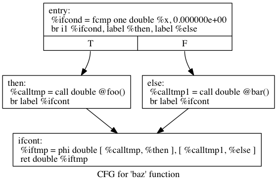
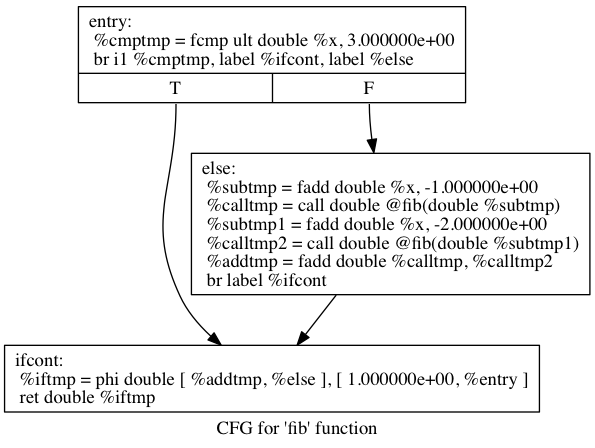
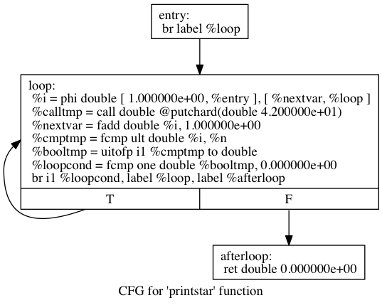

## LLVM IR 
- This document gives some examples of the output LLVM IR from the yorkie language.
- It is possible to generate the control-graph-flow images from LLVM IR with the following command:

```
    llvm-as < t.ll | opt -analyze -view-cfg
```

- You can view the resulting `.dot` files in GraphViz.

### Branching

Simple branching example:

Code:
```
extern foo();
extern bar();
def baz(x) if x then foo() else bar();
```

By generating code without optimizations, we end up with the following LLVM IR:
```
declare double @foo()

declare double @bar()

define double @baz(double %x) {
entry:
  %ifcond = fcmp one double %x, 0.000000e+00
  br i1 %ifcond, label %then, label %else

then:       ; preds = %entry
  %calltmp = call double @foo()
  br label %ifcont

else:       ; preds = %entry
  %calltmp1 = call double @bar()
  br label %ifcont

ifcont:     ; preds = %else, %then
  %iftmp = phi double [ %calltmp, %then ], [ %calltmp1, %else ]
  ret double %iftmp
}
```

Here's the control flow graph:



### Fibonacci
Code:

```
def fib(x)
    if x < 3 then
        1
    else
        fib(x-1)+fib(x-2)
```

LLVM IR:
```
define double @fib(double %x) {
entry:
  %cmptmp = fcmp ult double %x, 3.000000e+00
  br i1 %cmptmp, label %ifcont, label %else

else:                                             ; preds = %entry
  %subtmp = fadd double %x, -1.000000e+00
  %calltmp = call double @fib(double %subtmp)
  %subtmp1 = fadd double %x, -2.000000e+00
  %calltmp2 = call double @fib(double %subtmp1)
  %addtmp = fadd double %calltmp, %calltmp2
  br label %ifcont

ifcont:                                           ; preds = %entry, %else
  %iftmp = phi double [ %addtmp, %else ], [ 1.000000e+00, %entry ]
  ret double %iftmp
}
```

Control flow graph:



### For loop
Code: 

```
extern putchard(char)
def printstar(n)
  for i = 1, i < n, 1.0 in
    putchard(42);  # ascii 42 = '*'
```

LLVM IR:
```
declare double @putchard(double %char)

define double @printstar(double %n) {
entry:
  br label %loop

loop:                                             ; preds = %loop, %entry
  %i = phi double [ 1.000000e+00, %entry ], [ %nextvar, %loop ]
  %calltmp = call double @putchard(double 4.200000e+01)
  %nextvar = fadd double %i, 1.000000e+00
  %cmptmp = fcmp ult double %i, %n
  %booltmp = uitofp i1 %cmptmp to double
  %loopcond = fcmp one double %booltmp, 0.000000e+00
  br i1 %loopcond, label %loop, label %afterloop

afterloop:                                        ; preds = %loop
  ret double 0.000000e+00
}
```

Control flow graph:


